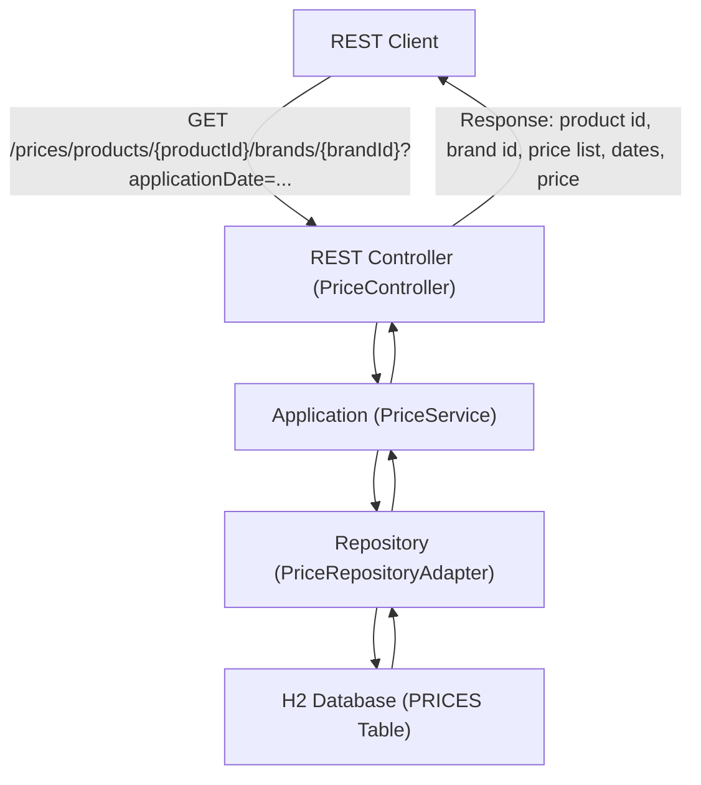

# Pricing Service

An example microservice for price management.

## Table of Contents
- [Description](#description)
- [Requirements](#requirements)
- [Technologies](#technologies)
- [Assumptions](#assumptions)
- [Development prerequisites](#development-prerequisites)
- [Build](#build)
- [Run](#run)
- [Configuration](#configuration)
- [API Contract](#api-contract)
- [API Documentation](#api-documentation)
- [Tests](#tests)
- [Architecture and Design Principles](#architecture-and-design-principles)
- [Project structure](#project-structure)
- [Static analysis and linters](#static-analysis-and-linters)
- [Local best practices](#local-best-practices)
- [Contributing](#contributing)
- [Troubleshooting](#troubleshooting)
- [Future improvements](#future-improvements)

---

## Description

This is a **Java Spring Boot microservice** exposing price-related operations.  
It includes:
- Persistence with H2 in-memory database
- Data initialization scripts
- OpenAPI specification (`docs/pricing-service-openapi-v2.0.0.yaml`)
- Integration tests for the required business cases

---

## Requirements

See the [detailed requirements documentation](docs/requirements.md) for prioritization, justification, and the system flow diagram.

**Key requirements summary:**
- REST endpoint to query prices by date, product, and brand.
- Price selection by priority and date range.
- In-memory H2 database with sample data.
- Integration tests for the 5 defined cases.

---

## Technologies

- Java 21 + Spring Boot 3
- Gradle (wrapper included)
- H2 in-memory database
- SQL initialization scripts: `src/main/resources/schema.sql` and `src/main/resources/data.sql`

---

## Assumptions

- Project uses the Gradle wrapper (`gradlew` / `gradlew.bat`).
- Examples are written for **Windows PowerShell**.
- Main class: `com.bcncgroup.pricingservice.Application`.

---

## Development prerequisites

- JDK 21 (recommended).
- No global Gradle needed — use the included wrapper.

---

## Build

Open PowerShell in the project root and run:

```powershell
.\gradlew.bat clean build
```

Jar will be generated in `build\libs\`.

---

## Run

Service can be started in different ways:

### Option A — Run with Gradle
Runs the app directly from the Gradle process:

```powershell
.\gradlew.bat bootRun
```

### Option B — Run the built artifact
First, build the project:

```powershell
.\gradlew.bat clean build
```

Then start the service with:
```powershell
java -jar build\libs\pricing-service-2.0.0.jar
```

### Option C — Run with Docker (optional)
If Docker is available, the image can be built and run:

```powershell
docker build -t pricing-service .
docker run -p 8080:8080 pricing-service
```
Service will be available at http://localhost:8080

#### About the Dockerfile

The provided `Dockerfile` builds the Java project using Gradle and packages it into a container image. It performs the following steps:
- Uses the official OpenJDK 21 image as a base.
- Copies all necessary project files and Gradle wrapper scripts.
- Grants execution permissions to the Gradle wrapper.
- Runs the Gradle build to generate the application JAR.
- Sets the default command to run the service with `java -jar`.

This allows building and running the service in a consistent, isolated environment using Docker.

---

## Configuration

- The application can be configured using the file `src/main/resources/application.yaml`.
- To change the database or the server port, edit `application.yaml` or provide environment variables.
- The `schema.sql` and `data.sql` files in `src/main/resources/` are used to initialize the database where supported.

---

## API Contract

- **Input:** REST HTTP requests with JSON bodies according to the OpenAPI spec in `docs/`.
- **Output:** JSON responses with price data.
- **Errors:** 4xx/5xx with JSON error details.

## API Documentation

- The OpenAPI specification is located in the `docs/` folder.  
- It can be imported into Postman or visualized using Swagger UI at `http://localhost:8080/swagger-ui.html`.

### **Example request/response:**
This request fetches the price for product `35455` and brand `1` on a specific date.

```sh
curl -X GET 'http://localhost:8080/prices/products/35455/brands/1?applicationDate=2020-06-14T10:00:00Z'
```

Expected Response:

```sh
{
  "productId": 35455,
  "brandId": 1,
  "priceList": 1,
  "startDate": "2020-06-14T00:00:00Z",
  "endDate": "2020-12-31T23:59:59Z",
  "finalPrice": 35.50
}
```

For a complete API definition, see the [OpenAPI specification](docs/pricing-service-openapi-v2.0.0.yaml).

---

## Tests

Run all tests:

```powershell
.\gradlew.bat test
```
Reports are generated in `build/reports/tests/test/index.html`.  

Additional details can be found in [test strategy](docs/test-strategy.md) documentation.

---

## Architecture and Design Principles

The service follows a hexagonal architecture, separating concerns into layers:



**Main components:**
- **REST Controller:** Receives HTTP requests and delegates to the application layer.
- **Application Service:** Contains business logic for price selection.
- **Repository Adapter:** Handles data access and persistence.
- **Database:** Stores price data.

### Key Design Decisions & Efficiency

To ensure performance and scalability, the following principles were applied:

- **Database-First Filtering:** The service delegates all filtering, sorting, and pagination logic directly to the database engine. This is crucial for optimal performance with large datasets. 
- **Minimal Memory Footprint:** By crafting precise queries, only the necessary data is fetched from the database. No in-memory filtering or redundant loops are performed on the application side.
- **Extensibility through Abstraction:** The use of interfaces (ports) and adapters allows for future optimizations, such as adding a caching layer, without altering the core business logic in the application service.

---

## Project structure

- `src/main/java` — source code  
- `src/main/resources` — configuration & SQL  
- `docs/` — OpenAPI specification and additional documentation  
- `build.gradle`, `gradlew*` — build system files  

---

## Local best practices

- Run `clean build` before opening a PR.
- Keep tests green on the `develop` branch.
- Update the OpenAPI specification when endpoints change.  

---

## Contributing

1. Use clear branch names (`feature/...`, `fix/...`).  
2. Add or update tests when making changes.  
3. Open a pull request to the `develop` branch with a description and verification steps.  

---

## Troubleshooting

- Ensure Java 21 is installed and available in the system path.  
- Ensure execution rights for the Gradle wrapper scripts.  
- If dependencies cause issues, clear the Gradle cache and refresh them (`.\gradlew.bat --refresh-dependencies`).  

---

## Future improvements

- JWT authentication  
- Replace H2 with PostgreSQL  
- Docker Compose for quick startup  
- Monitoring with Spring Boot Actuator  
- Kubernetes deployment examples
