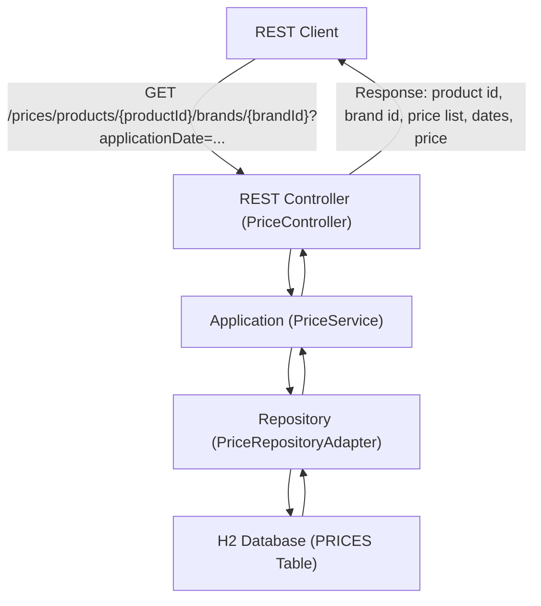

# Pricing Service

Example microservice for price management (pricing-service).

## Description

This is a Java Spring Boot microservice exposing price-related operations. It includes persistence, data initialization scripts and an OpenAPI specification located at `docs/pricing-service-openapi-v1.0.0.yaml`.

---

## Requirements Interpretation and Prioritization (MoSCoW)

### 1. Data Flow Diagram (DFD) / Blueprint



**Flow description:**
1. The client makes a GET request to the `/prices` endpoint with the required parameters.
2. The REST controller receives the request and delegates the logic to the application service.
3. The service queries the repository, which accesses the H2 database.
4. The applicable price is selected according to priority and date rules.
5. The response is returned with the requested data.

---

### 2. Requirements Prioritization (MoSCoW)

| Requirement                                                              | Priority    | Justification                                                                              |
|--------------------------------------------------------------------------|-------------|--------------------------------------------------------------------------------------------|
| REST GET endpoint accepting date, product id, and brand id               | Must-have   | Core functionality of the service.                                                         |
| Return: product id, brand id, price list, application dates, price       | Must-have   | Specified as mandatory output.                                                             |
| In-memory H2 database initialized with sample data                       | Must-have   | Enables testing and standalone operation.                                                  |
| Price selection by priority and date range                               | Must-have   | Main business logic.                                                                       |
| Integration tests for the 5 cases in the statement                       | Must-have   | Functional and business validation.                                                        |
| Hexagonal architecture                                                   | Should-have | Improves maintainability and layer separation.                                             |
| Code clarity and quality (SOLID, best practices)                         | Should-have | Facilitates maintenance and scalability.                                                   |
| Documentation (README, requirements, diagram)                            | Should-have | Improves understanding and validation of development.                                      |
| Version control (Git)                                                    | Should-have | Good collaborative development practice.                                                   |
| Data extraction efficiency                                               | Could-have  | Optimization, but not blocking for basic functionality.                                    |
| External configuration (application.yaml, Dockerfile)                    | Could-have  | Facilitates deployment and portability.                                                    |
| Return a single result (not a list)                                      | Must-have   | Specified in the statement.                                                                |
| Formal validation of requirements with the team/client                   | Must-have   | Prevents misunderstandings and ensures alignment of expectations.                          |
| Extension to other products/brands/currencies                            | Won't-have  | Out of scope for the current statement.                                                    |

---

### 3. Formal Requirements Validation

**Recommendation:**  
Before proceeding with implementation, this document should be reviewed with the team or client to confirm that the interpretation and prioritization of requirements is correct and complete. This will prevent misunderstandings and allow expectations to be aligned.

---

## Technologies

- Java + Spring Boot
- Gradle (wrapper included)
- SQL initialization scripts: `src/main/resources/schema.sql` and `src/main/resources/data.sql`

## Assumptions

- The project uses the Gradle wrapper (`gradlew` / `gradlew.bat`).
- You are working on Windows using PowerShell — commands below are tailored for that shell.
- The main application class is `com.bcncgroup.pricingservice.Application` (inferred from the compiled classes).

## API contract (brief)

- Input: REST HTTP requests with JSON bodies according to the OpenAPI spec in `docs/`.
- Output: JSON responses containing price resources and appropriate HTTP status codes.
- Errors: 4xx/5xx responses with JSON error details.

## Development prerequisites

- JDK installed (Java 21 recommended).
- No global Gradle installation required — use the included wrapper.

## Build (PowerShell)

Open PowerShell in the project root and run:

```
.\gradlew.bat clean build
```

The resulting jar will be available under `build\libs\`.

## Run (PowerShell)

Option A — run via Gradle (starts the app in the Gradle process):

```
.\gradlew.bat bootRun
```

Option B — run the built artifact:

```
java -jar build\libs\pricing-service-1.0.0.jar
```

## Configuration

- Main configuration file: `src/main/resources/application.yaml`.
- To change the database or the server port, edit `application.yaml` or provide environment variables.
- The `schema.sql` and `data.sql` files in `src/main/resources/` are used to initialize the database where supported.

## Tests

Run the test suite with:

```
.\gradlew.bat test
```

Test reports are available at `build/reports/tests/test/index.html`.

## API / Documentation

- The OpenAPI spec is located at `docs/pricing-service-openapi-v1.0.0.yaml`.
- Use it to generate clients or test endpoints with tools like Postman or Swagger UI.

## Project structure (summary)

- `src/main/java` — Java source code
- `src/main/resources` — configuration and SQL scripts
- `build.gradle`, `gradlew`, `gradlew.bat` — build and wrapper
- `docs/` — OpenAPI spec and additional docs

## Local best practices

- Run `clean build` before opening a PR.
- Keep tests green on the `develop` branch.
- Update `docs/pricing-service-openapi-v1.0.0.yaml` when endpoints change.

## Contributing

1. Create a branch with a clear name (`feature/...`, `fix/...`).
2. Add tests for functional changes.
3. Open a Pull Request targeting `develop` and describe the purpose and verification steps.

## Troubleshooting

- If Java is missing: install JDK 21 and verify with `java -version`.
- Permission issues: run PowerShell as Administrator or adjust execution policies.
- Dependency problems: delete `.gradle` and run `.\gradlew.bat --refresh-dependencies`.

## License & contact

- Add the project license here (e.g. MIT) or list the contact person/team.

## Quick verification

- This README is intended to help local development and quick start on Windows PowerShell.

## Notes

- The repository already contains build artifacts in `build/libs/` and test results in `test-results/`.

## Next steps I can do for you

- Add endpoint examples (HTTP requests) extracted from the OpenAPI spec.
- Create a Dockerfile and docker instructions.
- Add a CI workflow (GitHub Actions) for build and tests.

If you want any of the above, tell me which one and I'll implement it.

---

## Static analysis and linters (Docker)

This project includes a `Dockerfile` prepared to run static code analysis with the following tools on Java 21:

- PMD
- Checkstyle
- SpotBugs
- Spotless

### Requirements

- Docker installed
- Source code at the root of the project (as in this repository)

### Build the image

```sh
docker build -t java-linters .
```

### Launch the container

```sh
docker run --rm -it java-linters bash
```

### PMD

Analyze the source code with PMD:

```sh
/opt/pmd/bin/run.sh pmd -d src/main/java -R rulesets/java/quickstart.xml -f text
```
> Note: The script `/opt/pmd/bin/pmd.bat` is for Windows only. In the Linux container, always use `/opt/pmd/bin/run.sh`.

### Checkstyle

Check code style with Checkstyle:

```sh
java -jar /opt/checkstyle.jar -c /app/google_checks.xml src/main/java
```

### SpotBugs

Now SpotBugs runs directly with Gradle, no Docker needed.

First, build the project (optional, SpotBugs will compile automatically if needed):

```sh
./gradlew spotbugsMain
```

The HTML report will be available at `build/reports/spotbugs/main.html`.

To analyze the tests:
```sh
./gradlew spotbugsTest
```
The report will be at `build/reports/spotbugs/test.html`.

### Spotless

Automatically format the code (if configured in `build.gradle`):

```sh
./gradlew spotlessApply
```

With these commands you can run the main linters on the project's source code using the provided Docker container.
