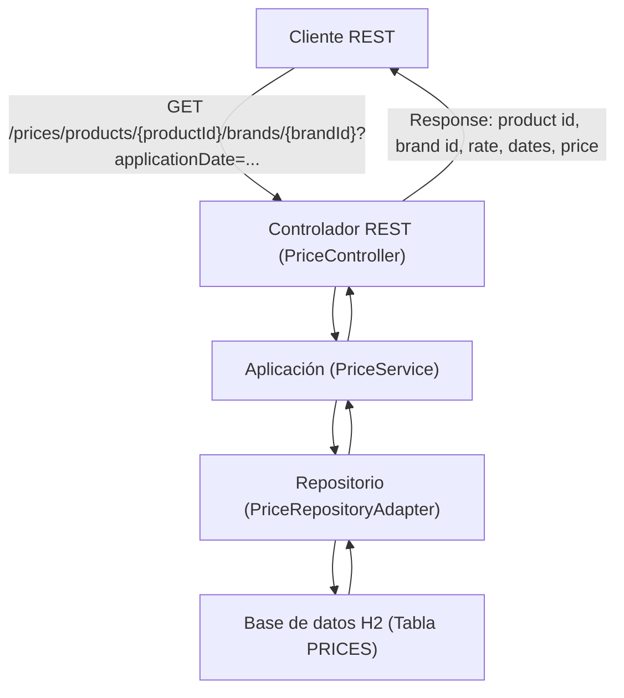

# Pricing Service

Example microservice for price management (pricing-service).

## Description

This is a Java Spring Boot microservice exposing price-related operations. It includes persistence, data initialization scripts and an OpenAPI specification located at `docs/pricing-service-openapi-v1.0.0.yaml`.

---

## Requirements Interpretation and Prioritization (MoSCoW)

### 1. Data Flow Diagram (DFD) / Blueprint



**Descripción del flujo:**
1. El cliente realiza una petición GET al endpoint `/prices` con los parámetros requeridos.
2. El controlador REST recibe la petición y delega la lógica al servicio de aplicación.
3. El servicio consulta el repositorio, que accede a la base de datos H2.
4. Se selecciona el precio aplicable según las reglas de prioridad y fechas.
5. Se devuelve la respuesta con los datos solicitados.

---

### 2. Priorización de Requisitos (MoSCoW)

| Requisito                                                                 | Prioridad  | Justificación                                                                                 |
|---------------------------------------------------------------------------|------------|----------------------------------------------------------------------------------------------|
| Endpoint REST GET que acepte fecha, id de producto e id de cadena         | Must-have  | Es el núcleo funcional del servicio.                                                         |
| Devolver: id producto, id cadena, tarifa, fechas de aplicación, precio    | Must-have  | Especificado como salida obligatoria.                                                        |
| Base de datos en memoria H2, inicializada con los datos de ejemplo        | Must-have  | Permite pruebas y funcionamiento autónomo.                                                   |
| Selección de tarifa por prioridad y rango de fechas                       | Must-have  | Lógica de negocio principal.                                                                 |
| Pruebas de integración para los 5 casos del enunciado                     | Must-have  | Validación funcional y de negocio.                                                           |
| Arquitectura hexagonal                                                    | Should-have| Mejora mantenibilidad y separación de capas.                                                 |
| Claridad y calidad de código (SOLID, buenas prácticas)                    | Should-have| Facilita mantenimiento y escalabilidad.                                                      |
| Documentación (README, requisitos, diagrama)                              | Should-have| Mejora la comprensión y validación del desarrollo.                                           |
| Control de versiones (Git)                                                | Should-have| Buenas prácticas de desarrollo colaborativo.                                                 |
| Eficiencia en la extracción de datos                                      | Could-have | Optimización, pero no bloqueante para la funcionalidad básica.                               |
| Configuración externa (application.yaml, Dockerfile)                      | Could-have | Facilita despliegue y portabilidad.                                                          |
| Devolver único resultado (no lista)                                       | Must-have  | Especificado en el enunciado.                                                                |
| Validación formal de requisitos con el equipo/cliente                     | Must-have  | Evita malentendidos y asegura alineación de expectativas.                                    |
| Ampliación a otros productos/cadenas/monedas                              | Won't-have | Fuera del alcance del enunciado actual.                                                      |

---

### 3. Validación Formal de Requisitos

**Recomendación:**  
Antes de continuar con la implementación, se debe revisar este documento con el equipo o cliente para confirmar que la interpretación y priorización de los requisitos es correcta y completa. Esto evitará malentendidos y permitirá alinear expectativas.

---

## Technologies

- Java + Spring Boot
- Gradle (wrapper included)
- SQL initialization scripts: `src/main/resources/schema.sql` and `src/main/resources/data.sql`

## Assumptions

- The project uses the Gradle wrapper (`gradlew` / `gradlew.bat`).
- You are working on Windows using PowerShell — commands below are tailored for that shell.
- The main application class is `com.bcncgroup.pricingservice.Application` (inferred from the compiled classes).

## API contract (brief)

- Input: REST HTTP requests with JSON bodies according to the OpenAPI spec in `docs/`.
- Output: JSON responses containing price resources and appropriate HTTP status codes.
- Errors: 4xx/5xx responses with JSON error details.

## Development prerequisites

- JDK installed (Java 21 recommended).
- No global Gradle installation required — use the included wrapper.

## Build (PowerShell)

Open PowerShell in the project root and run:

```
.\gradlew.bat clean build
```

The resulting jar will be available under `build\libs\`.

## Run (PowerShell)

Option A — run via Gradle (starts the app in the Gradle process):

```
.\gradlew.bat bootRun
```

Option B — run the built artifact:

```
java -jar build\libs\pricing-service-1.0.0.jar
```

## Configuration

- Main configuration file: `src/main/resources/application.yaml`.
- To change the database or the server port, edit `application.yaml` or provide environment variables.
- The `schema.sql` and `data.sql` files in `src/main/resources/` are used to initialize the database where supported.

## Tests

Run the test suite with:

```
.\gradlew.bat test
```

Test reports are available at `build/reports/tests/test/index.html`.

## API / Documentation

- The OpenAPI spec is located at `docs/pricing-service-openapi-v1.0.0.yaml`.
- Use it to generate clients or test endpoints with tools like Postman or Swagger UI.

## Project structure (summary)

- `src/main/java` — Java source code
- `src/main/resources` — configuration and SQL scripts
- `build.gradle`, `gradlew`, `gradlew.bat` — build and wrapper
- `docs/` — OpenAPI spec and additional docs

## Local best practices

- Run `clean build` before opening a PR.
- Keep tests green on the `develop` branch.
- Update `docs/pricing-service-openapi-v1.0.0.yaml` when endpoints change.

## Contributing

1. Create a branch with a clear name (`feature/...`, `fix/...`).
2. Add tests for functional changes.
3. Open a Pull Request targeting `develop` and describe the purpose and verification steps.

## Troubleshooting

- If Java is missing: install JDK 21 and verify with `java -version`.
- Permission issues: run PowerShell as Administrator or adjust execution policies.
- Dependency problems: delete `.gradle` and run `.\gradlew.bat --refresh-dependencies`.

## License & contact

- Add the project license here (e.g. MIT) or list the contact person/team.

## Quick verification

- This README is intended to help local development and quick start on Windows PowerShell.

## Notes

- The repository already contains build artifacts in `build/libs/` and test results in `test-results/`.

## Next steps I can do for you

- Add endpoint examples (HTTP requests) extracted from the OpenAPI spec.
- Create a Dockerfile and docker instructions.
- Add a CI workflow (GitHub Actions) for build and tests.

If you want any of the above, tell me which one and I'll implement it.

---

## Análisis estático y linters (Docker)

Este proyecto incluye un `Dockerfile` preparado para ejecutar análisis estático de código con las siguientes herramientas sobre Java 21:

- PMD
- Checkstyle
- SpotBugs
- Spotless

### Requisitos

- Docker instalado
- Código fuente en la raíz del proyecto (como está en este repositorio)

### Construir la imagen

```sh
docker build -t java-linters .
```

### Lanzar el contenedor

```sh
docker run --rm -it java-linters bash
```

### PMD

Analiza el código fuente con PMD:

```sh
/opt/pmd/bin/run.sh pmd -d src/main/java -R rulesets/java/quickstart.xml -f text
```
> Nota: El script `/opt/pmd/bin/pmd.bat` es solo para Windows. En el contenedor Linux, usa siempre `/opt/pmd/bin/run.sh`.

### Checkstyle

Verifica el estilo de código con Checkstyle:

```sh
java -jar /opt/checkstyle.jar -c /app/google_checks.xml src/main/java
```

### SpotBugs

Detecta posibles bugs con SpotBugs (analiza los archivos .class, no el código fuente):

Primero, compila el proyecto:
```sh
./gradlew build
```

Luego, ejecuta SpotBugs sobre las clases compiladas:
```sh
spotbugs -effort:max -low build/classes/java/main
```

### Spotless

Formatea el código automáticamente (si está configurado en `build.gradle`):

```sh
./gradlew spotlessApply
```

Con estos comandos puedes ejecutar los linters principales sobre el código fuente del proyecto usando el contenedor Docker proporcionado.
