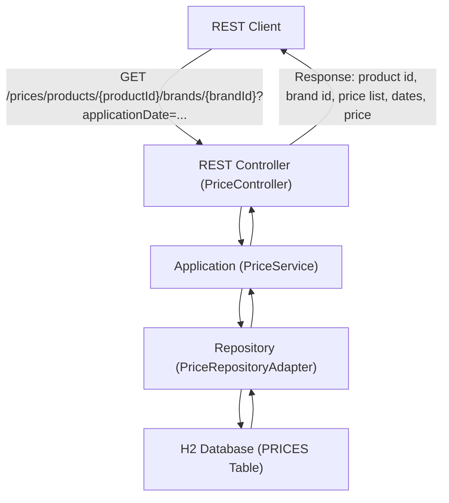

# Requirements Interpretation and Prioritization (MoSCoW)

## 1. Data Flow Diagram (DFD) / Blueprint

**Flow description:**
1. The client makes a GET request to the `/prices` endpoint with the required parameters.
2. The REST controller receives the request and delegates the logic to the application service.
3. The service queries the repository, which accesses the H2 database.
4. The applicable price is selected according to priority and date rules.
5. The response is returned with the requested data.

---

## 2. Requirements Prioritization (MoSCoW)

| Requirement                                                              | Priority    | Justification                                                                              |
|--------------------------------------------------------------------------|-------------|--------------------------------------------------------------------------------------------|
| REST GET endpoint accepting date, product id, and brand id               | Must-have   | Core functionality of the service.                                                         |
| Return: product id, brand id, price list, application dates, price       | Must-have   | Specified as mandatory output.                                                             |
| In-memory H2 database initialized with sample data                       | Must-have   | Enables testing and standalone operation.                                                  |
| Price selection by priority and date range                               | Must-have   | Main business logic.                                                                       |
| Integration tests for the 5 cases in the statement                       | Must-have   | Functional and business validation.                                                        |
| Hexagonal architecture                                                   | Should-have | Improves maintainability and layer separation.                                             |
| Code clarity and quality (SOLID, best practices)                         | Should-have | Facilitates maintenance and scalability.                                                   |
| Documentation (README, requirements, diagram)                            | Should-have | Improves understanding and validation of development.                                      |
| Version control (Git)                                                    | Should-have | Good collaborative development practice.                                                   |
| Data extraction efficiency                                               | Could-have  | Optimization, but not blocking for basic functionality.                                    |
| External configuration (application.yaml, Dockerfile)                    | Could-have  | Facilitates deployment and portability.                                                    |
| Return a single result (not a list)                                      | Must-have   | Specified in the statement.                                                                |
| Formal validation of requirements with the team/client                   | Must-have   | Prevents misunderstandings and ensures alignment of expectations.                          |
| Extension to other products/brands/currencies                            | Won't-have  | Out of scope for the current statement.                                                    |

---

## 3. Formal Requirements Validation

**Recommendation:**  
Before proceeding with implementation, this document should be reviewed with the team or client to confirm that the interpretation and prioritization of requirements is correct and complete. This will prevent misunderstandings and allow expectations to be aligned.
