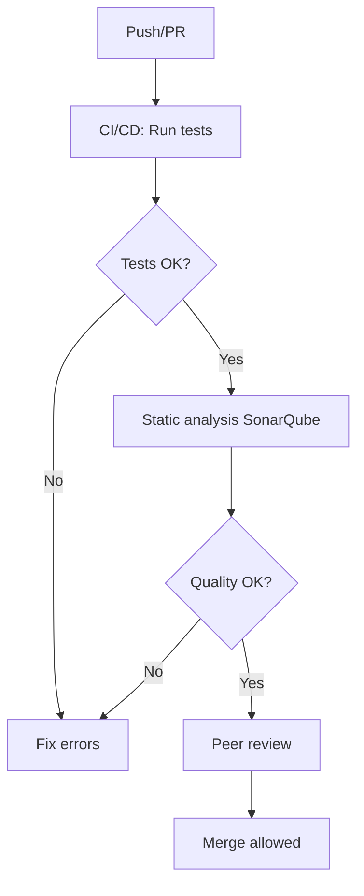

# Test Strategy – Pricing Service

## Introduction

This document outlines the test strategy for the Pricing Service microservice. The goal is to ensure the quality, robustness, and maintainability of the service by detecting defects early, providing fast feedback, and enabling safe extensibility.

## 1. Objectives

- Ensure the quality, robustness, and maintainability of the service.
- Detect defects early and efficiently.
- Provide fast and reliable feedback on every change.
- Facilitate safe extensibility and evolution of the system.

## 2. Test Levels

- **Unit Tests:**  
  Validate the behavior of individual components (services, controllers, mappers, etc.).  
  *Tools:* JUnit 5, Mockito.  
  *Example:* Verify that the price calculation method returns the expected value for a given set of parameters.

- **Integration Tests:**  
  Verify the interaction between components and integration with external dependencies (repositories, database, etc.).  
  *Tools:* JUnit 5, Spring Boot Test, H2 (in-memory DB).  
  *Example:* Ensure that a REST request stores and retrieves data correctly from the database.

- **API Tests (optional):**  
  Validate the exposed REST endpoints.  
  *Tools:* MockMvc, RestAssured.  
  *Example:* Test that the `/prices/products/{productId}/brands/{brandId}` endpoint responds correctly to different input scenarios.

## 3. Tools

- **JUnit 5:** Main testing framework.
- **Mockito:** Dependency mocking.
- **Jacoco:** Code coverage measurement.
- **SonarQube:** Static analysis for quality and security.
- **CI/CD (GitHub Actions, Jenkins, GitLab CI, etc.):** Automated test execution and analysis.

## 4. Recommended Coverage

- **Minimum recommended coverage:**  
  - Unit: ≥ 80% of lines and critical branches.
  - Integration: Coverage of main business flows.
- **Code coverage periodically reviewed in SonarQube.**

## 5. Test Prioritization (RBT – Risk Based Testing)

- Identify critical functionalities (e.g., pricing logic, validations, persistence).
- Prioritize tests on:
  - Core business logic.
  - Validations and error handling.
  - Integrations with external systems.
- Lower priority for accessory or low-impact code.

## 6. Automation and CI/CD

- All unit and integration tests must run automatically on every push/pull request.
- The CI/CD pipeline must:
  - Run tests and static analysis.
  - Block merges if tests fail or coverage drops.
  - Generate coverage and quality reports.

## 7. Static Analysis and Peer Review

- **SonarQube** integrated in CI to detect code smells, bugs, and vulnerabilities.
- **Peer review** required for every pull request:
  - Validate code and test quality.
  - Review coverage and edge cases.

## 8. Extensibility and Best Practices

- New features must include their own tests.
- Refactorings must maintain or improve coverage.
- Document relevant test cases in each PR.
- Keep tests readable, independent, and fast.
- Use descriptive names for test methods.
- Avoid logic in test setup; use builders or factories for test data.

---

## Visual Summary

The following diagram summarizes the quality flow in the development cycle:

**Explanation:**  
Every change triggers automated tests and static analysis. Only if all tests pass and quality gates are met, the code is eligible for peer review and merging. This ensures that only high-quality, well-tested code is integrated into the main branch.
